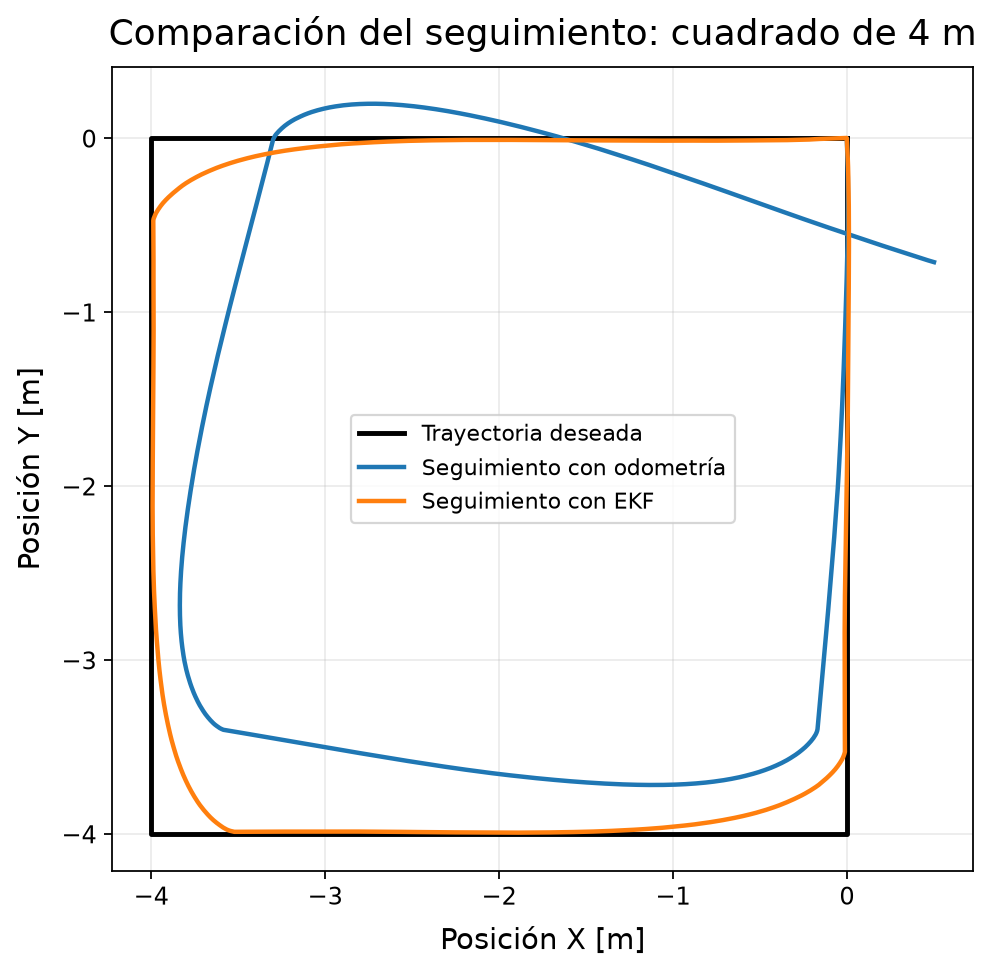
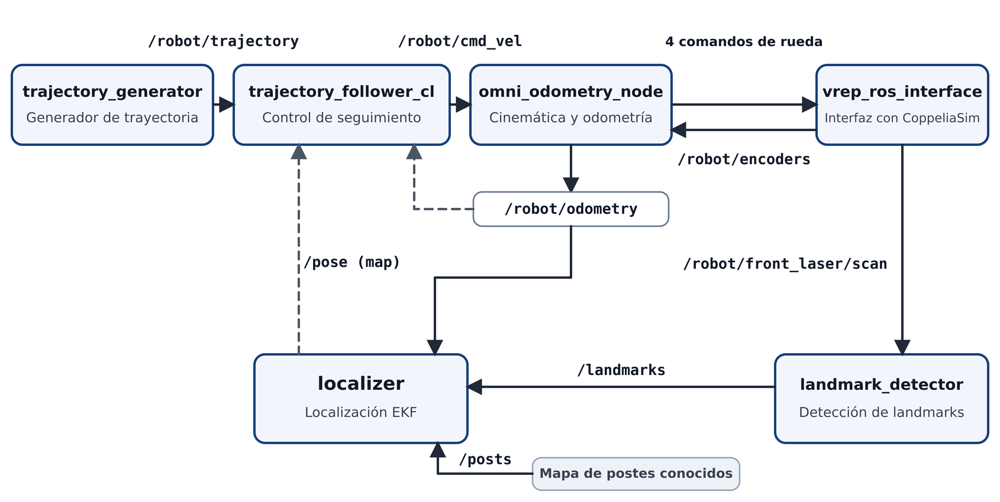

# Robot Mecanum: cinemática, odometría y localización con EKF en ROS 2

**Español** | [English](README.en.md)

Trabajo final de la materia Robótica Móvil (Exactas, UBA), 2026. Un robot de
cuatro ruedas Mecanum simulado en CoppeliaSim y controlado con ROS 2:
cinemática inversa y directa, odometría a partir de los encoders, seguimiento
de trayectorias a lazo cerrado y localización con un EKF basado en landmarks.

El informe completo, con las deducciones y todos los experimentos, está en
[report/Informe_TP_Final_Robotica.pdf](report/Informe_TP_Final_Robotica.pdf).
El código no está publicado porque se apoya en material provisto por la
cátedra.

*Seguimiento de un cuadrado de 4 m con los mismos parámetros del controlador.
Negro: trayectoria deseada. Azul: realimentación con odometría. Naranja:
realimentación con el EKF.*

## Sistema

- **Cinemática y odometría:** convierte los comandos de velocidad en
  velocidades de rueda, reconstruye la velocidad del chasis a partir de los
  encoders y la integra para obtener la pose.
- **Seguimiento de trayectorias:** un generador de trayectorias y un
  controlador proporcional que toma la pose objetivo con un *lookahead*. La
  realimentación puede venir de la odometría o del EKF.
- **Detección de landmarks:** detecta en el escaneo del láser los postes cuya
  posición se conoce.
- **Localización con EKF:** combina la predicción odométrica con observaciones
  de distancia y ángulo a los postes detectados.
- **Logger:** registra odometría, ground truth, pose del EKF, referencia y
  comandos para analizarlos después.

## Resultados

**Seguimiento de un cuadrado de 4 m, mismos parámetros del controlador:**

| Realimentación | Error medio | Error máximo | Error final | Tiempo |
|---|---|---|---|---|
| Odometría | 0.242 m | 0.573 m | 0.501 m | 67.90 s |
| EKF | 0.033 m | 0.233 m | 0.009 m | 69.80 s |

Los errores son distancias entre la posición real del robot, tomada del ground
truth del simulador, y la trayectoria deseada.

**Pruebas de localización sin el controlador** (error medio de posición):

| Prueba | Odometría | EKF |
|---|---|---|
| Movimiento circular | 0.0193 m | 0.0065 m |
| Cuadrado de 2 m (desplazamientos longitudinales y laterales) | 0.1174 m | 0.0027 m |
| Rotación sobre el lugar | 0.0037 m | 0.0065 m |

El EKF redujo el error de orientación en las tres pruebas y el error de
posición en dos de ellas. Durante la rotación sobre el lugar, la odometría
mantuvo un error de posición menor.

## Limitaciones

- Los parámetros del controlador se ajustaron con realimentación odométrica y
  después se usaron sin cambios con el EKF en el lazo. Ajustarlos con el EKF
  podría reducir los desvíos que quedan en las esquinas.
- El robot no siempre alcanzó las velocidades comandadas, sobre todo a
  velocidades altas y con movimientos combinados en x e y. Esto apunta a
  límites de los actuadores del robot simulado, más allá de la geometría
  Mecanum en sí.

## Autores

Mateo Guerrero Schmidt, Joaquín Eliseo Muñoz y Cristian Antonio.
