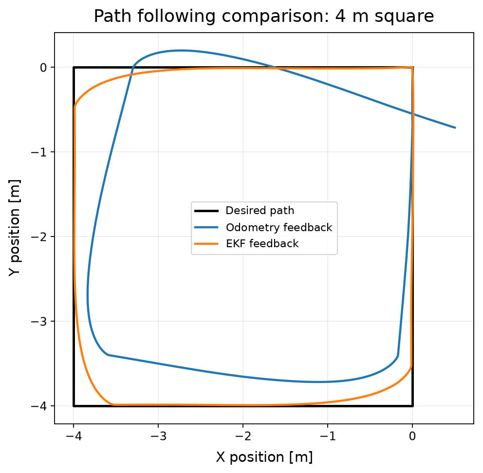
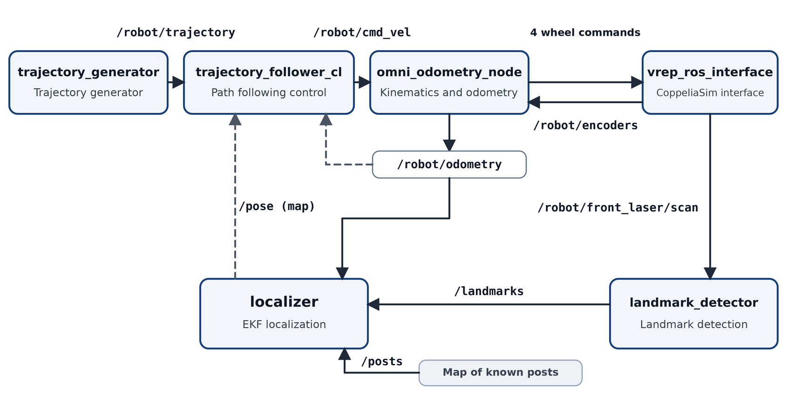

# Mecanum robot: kinematics, odometry and EKF localization in ROS 2

[Español](README.md) | **English**

Final project for the Mobile Robotics course at the University of Buenos Aires
(Exactas), 2026. A four-wheel Mecanum robot simulated in CoppeliaSim and
controlled with ROS 2, covering inverse and forward kinematics, encoder-based
odometry, closed-loop path following and EKF localization with landmarks.

The full report, with the derivations and all experiments, is in
[report/Informe_TP_Final_Robotica.pdf](report/Informe_TP_Final_Robotica.pdf)
(in Spanish). The code is not published because it builds on material
provided by the course.

*Path following on a 4 m square, same controller parameters. Black: desired
path. Blue: odometry feedback. Orange: EKF feedback.*

## System

- **Kinematics and odometry:** converts velocity commands into wheel speeds,
  reconstructs the chassis velocity from the encoders and integrates it into
  a pose.
- **Path following:** trajectory generator and a proportional controller with
  a lookahead point. Feedback comes either from odometry or from the EKF.
- **Landmark detection:** detects posts with known positions from the laser
  scan.
- **EKF localization:** combines the odometric prediction with range and
  bearing observations of the detected posts.
- **Logger:** records odometry, ground truth, EKF pose, reference and commands
  for later analysis.

## Results

**Path following on a 4 m square, same controller parameters:**

| Feedback | Mean error | Max error | Final error | Time |
|---|---|---|---|---|
| Odometry | 0.242 m | 0.573 m | 0.501 m | 67.90 s |
| EKF | 0.033 m | 0.233 m | 0.009 m | 69.80 s |

Errors are distances from the real robot position, taken from the
simulator's ground truth, to the desired path.

**Localization tests without the controller** (mean position error):

| Test | Odometry | EKF |
|---|---|---|
| Circular motion | 0.0193 m | 0.0065 m |
| 2 m square (longitudinal and lateral moves) | 0.1174 m | 0.0027 m |
| In-place rotation | 0.0037 m | 0.0065 m |

The EKF reduced the orientation error in all three tests and the position
error in two of them. During the in-place rotation, odometry kept a lower
position error.

## Limitations

- The controller parameters were tuned with odometric feedback and then
  reused with the EKF in the loop. Retuning them with the EKF could reduce the
  deviations that remain at the corners.
- The robot did not always reach the commanded velocities, especially at high
  speeds and with combined x and y motion. This points to actuator limits of
  the simulated robot, beyond the Mecanum geometry itself.

## Authors

Mateo Guerrero Schmidt, Joaquín Eliseo Muñoz and Cristian Antonio.
